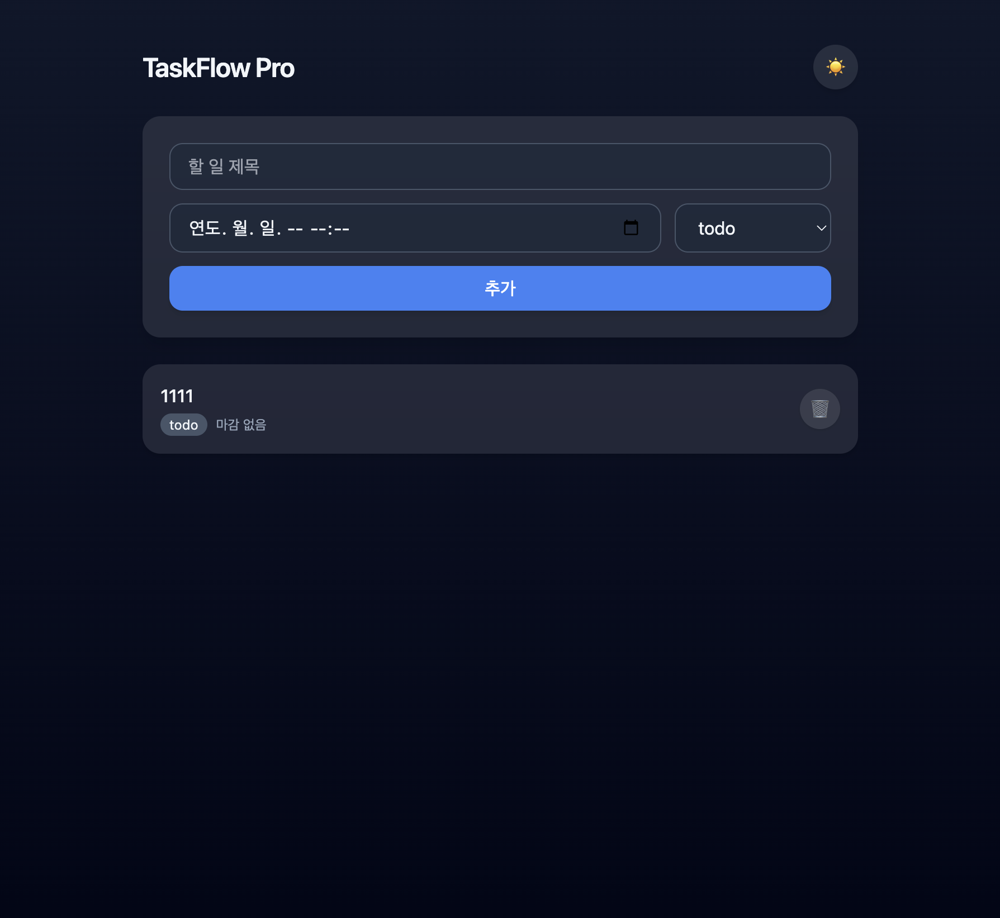
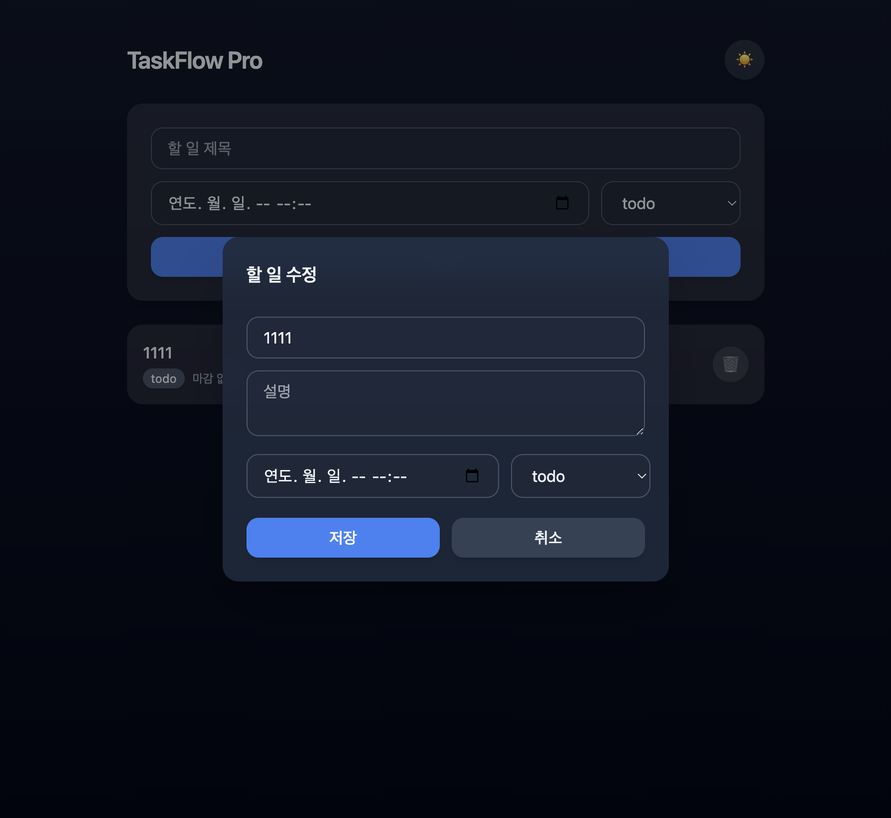
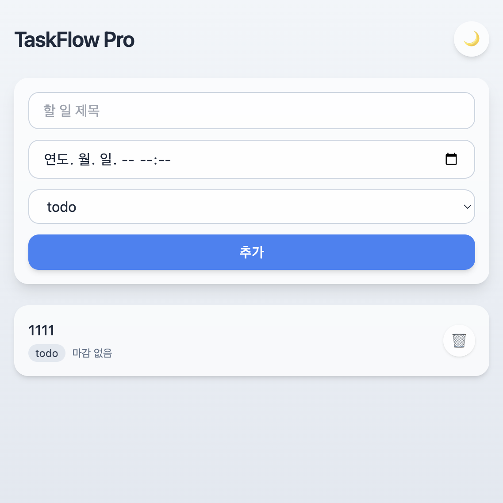

# TaskFlow Pro

팀 업무 관리 풀스택 웹 앱. "지금 누가 뭐 해?"라는 질문이 사라지게 만드는 것이 목표다.

## 기술 스택
- 백엔드: FastAPI + Python 3.11 이상 + SQLite
- 프론트엔드: Vanilla JS + Tailwind CDN (`index.html`, `app.js` 2개 파일)
- 모든 API 경로는 `/api/` 접두사 사용
- 테스트: pytest

## 실행 방법

```bash
cd backend
python3 -m venv .venv
./.venv/bin/pip install -r requirements.txt
./.venv/bin/uvicorn main:app --reload --port 8000
```

브라우저에서 `http://127.0.0.1:8000` 접속 (프론트엔드는 백엔드와 같은 오리진에서 제공됨).
API 문서(Swagger)는 `http://127.0.0.1:8000/docs`.

## 테스트

```bash
cd backend
./.venv/bin/python -m pytest -v
```

## 화면 워크플로우

1. 목록 화면 — 할 일 추가 폼 + 카드 목록 (status 배지, 마감까지 남은 시간)

   

2. 카드 클릭 → 수정 모달 — 전 필드(title/description/status/due_at) 수정 가능

   

3. 테마 토글 — 우측 상단 버튼으로 라이트/다크 전환, localStorage에 저장

   

## 기능 (MVP)
- 할 일 CRUD 4종: 추가 / 목록 / 수정 / 삭제
- 상태 분류(`todo` / `in_progress` / `done`) + 마감 시각(`due_at`) 지정 및 표시
- 라이트/다크 테마 토글 (localStorage 저장, 초기값은 시스템 설정)
- 모바일 반응형 (360px 기준)
- Mac OS 스타일 UI (둥근 모서리, 부드러운 그림자, 반투명 카드, 시스템 폰트)
- 목록은 3초 간격 폴링으로 갱신 (WebSocket 미사용)

## Task 모델

| 필드 | 타입 | 설명 |
|---|---|---|
| id | INTEGER, PK, AUTOINCREMENT | 자동 증가 |
| title | VARCHAR(200) | 필수 |
| description | TEXT | 선택 |
| status | todo / in_progress / done | 기본값 todo |
| due_at | DATETIME (UTC) | 선택 |
| created_at | DATETIME | 서버 자동 생성 |
| updated_at | DATETIME | 서버 자동 갱신 |

날짜 필드(`due_at`, `created_at`, `updated_at`)는 UTC ISO 8601로 응답하며, 화면에서 로컬 시간으로 변환해 표시한다.

## API

| Method | 경로 | 성공 응답 |
|---|---|---|
| POST | /api/tasks | 201 |
| GET | /api/tasks | 200 (description 제외) |
| GET | /api/tasks/{id} | 200 (description 포함) |
| PUT | /api/tasks/{id} | 200 |
| DELETE | /api/tasks/{id} | 204 |

검증 오류는 400(형식 위반), 404(존재하지 않는 id), 422(스펙에 없는 필드)로 구분된다.

## 프로젝트 문서
전체 설계 배경과 상세 스펙은 `docs/` 폴더를 참고한다. 읽는 순서:
1. `docs/00-overview.md`
2. `docs/01-product.md`
3. `docs/02-specs.md`
4. `docs/03-design.md`
5. `docs/04-tasks.md`
6. `docs/05-conventions.md`

작업 규칙(기술 스택 고정, 절대규칙 등)은 `CLAUDE.md`를 참고한다.
